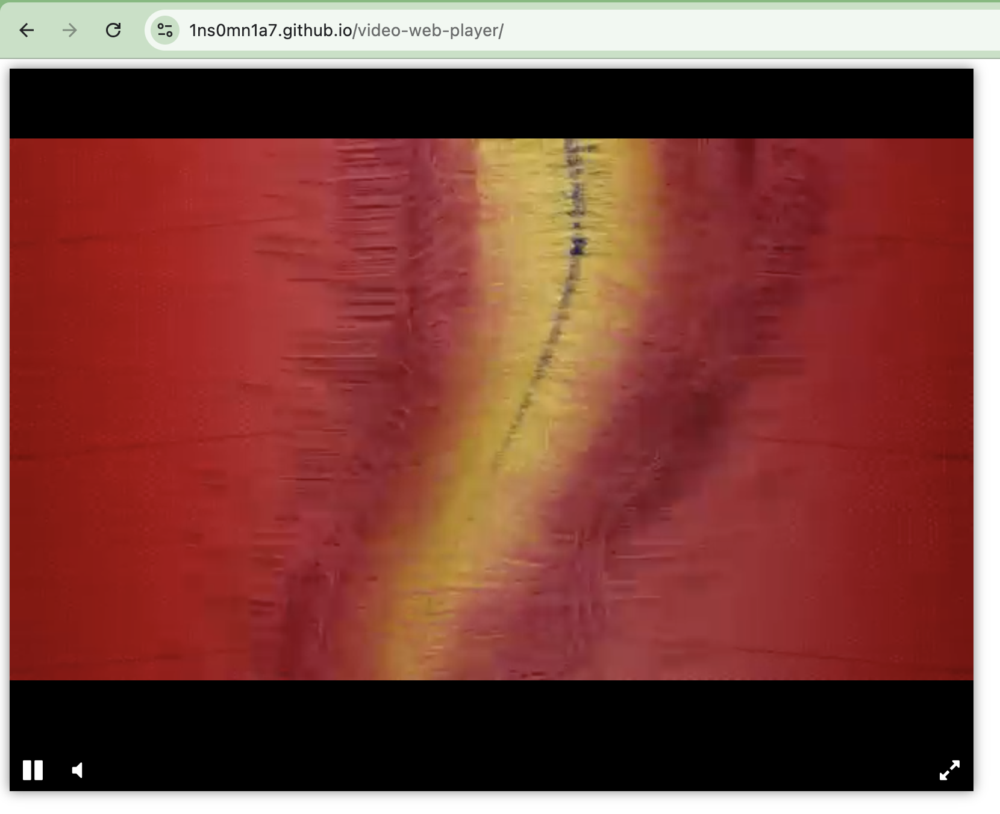

# Video Web Player



Кастомный HTML5-плеер с собственным управлением и стилизацией. Основан на библиотеке `Playable`, легко внедряется и настраивается.

## Установка
1. Скачайте `player.js` и подключите его вместе с зависимостями:

```html
<script src="https://code.jquery.com/jquery-3.4.1.min.js"></script>
<script src="https://unpkg.com/playable@2.10.3/dist/statics/playable.bundle.min.js"></script>
<script src="player.js"></script>
```

2. HTML-разметка
Добавьте контейнер с `id="player"` и вложенным элементом `.js-video-container`. Пример:

```html
<div id="player">
  <div class="js-video-container"></div>
</div>
```

Инициализируйте плеер:

```html
<script>
  createPlayer({ elementId: 'player' });
</script>
```

3. Добавление видео:
Чтобы указать своё видео:

```html
<script>
  createPlayer({
    elementId: 'player',
    src: 'https://example.com/video.mp4'
  });
</script>
```

4. Кнопки управления
Добавь в разметку элементы с нужными классами:

```html
<div class="player-bar">
  <button class="js-play-button" hidden><i class="fa fa-play"></i></button>
  <button class="js-pause-button" hidden><i class="fa fa-pause"></i></button>
  <button class="js-volume-button"><i class="fa fa-volume-off"></i></button>
  <button class="js-mute-button" hidden><i class="fa fa-volume-up"></i></button>
  <div class="spacer"></div>
  <button class="js-fullscreen-button"><i class="fa fa-expand"></i></button>
</div>
```
| Класс                   | Описание                             |
| ----------------------- | ------------------------------------ |
| `.js-play-button`       | Пуск видео                           |
| `.js-pause-button`      | Пауза видео                          |
| `.js-volume-button`     | Включить звук                        |
| `.js-mute-button`       | Выключить звук                       |
| `.js-fullscreen-button` | Переключение полноэкранного режима   |
| `.js-video-container`   | Контейнер, в который встроится плеер |

5. Кнопки управления
Пример встроенных стилей:

```css
#player {
  width: 800px;
  height: 600px;
  box-shadow: 0 0 10px rgba(0,0,0,0.5);
  display: flex;
  flex-direction: column;
}

.js-video-container {
  flex-grow: 1;
  background: black;
}

.player-bar {
  background: black;
  display: flex;
}

.player-bar button {
  border: none;
  cursor: pointer;
  color: white;
  margin: 5px 10px 5px 5px;
  background: transparent;
  font-size: larger;
  width: 24px;
  height: 24px;
}

.spacer {
  flex-grow: 1;
}
```

Подключите Font Awesome для иконок:
```html
<link rel="stylesheet" href="font-awesome-4.7.0/css/font-awesome.min.css">
```

## Онлайн-демо
Онлайн-демо: [Web Player](https://1ns0mn1a7.github.io/video-web-player/)

## Цель проекта
Код написан в образовательных целях на онлайн-курсе для веб-разработчиков [dvmn.org.](dvmn.org)